# Testing

Return back to the [README.md](README.md) file.

## Code Validation

### HTML

I have used the recommended [HTML W3C Validator](https://validator.w3.org) to validate all of my HTML files.

| Page | W3C URL | Screenshot | Notes |
| --- | --- | --- | --- |
| about | [W3C](https://validator.w3.org/) | 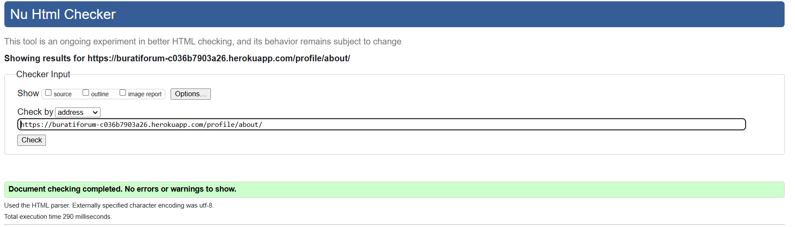 | Pass: No Errors |
| ask-question | [W3C - Validated By Input](https://validator.w3.org/) | 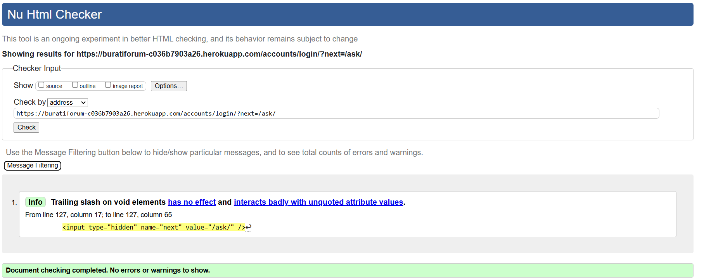 | Pass: No Errors |
| home | [W3C](https://validator.w3.org/) | 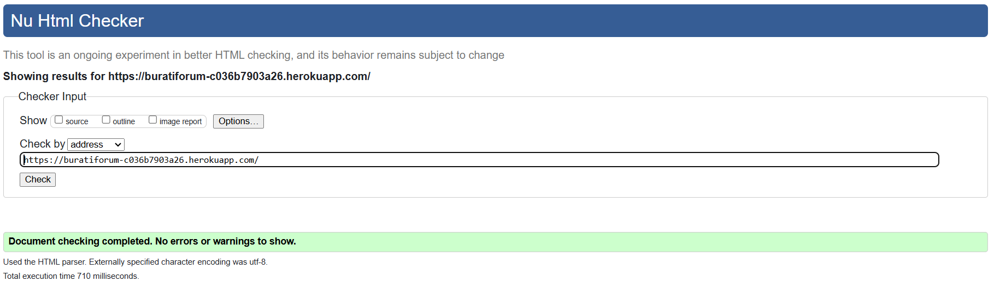 | Pass: No Errors |
| login | [W3C](https://validator.w3.org/) | 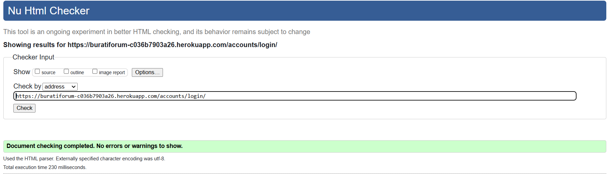 | Pass: No Errors |
| question-detail | [W3C](https://validator.w3.org/) | 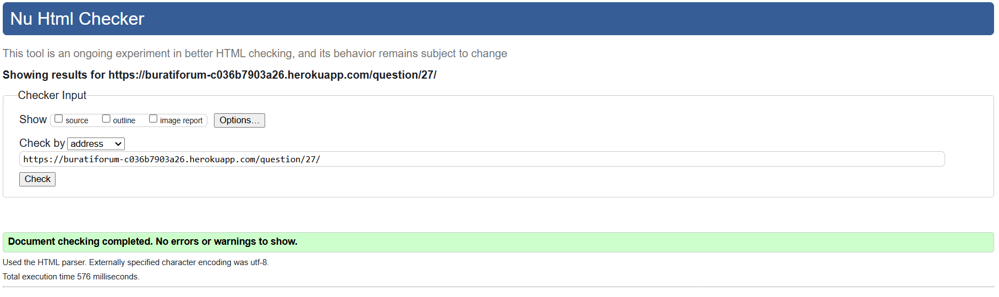 | Pass: No Errors |
| profile | [W3C - Validated By Input](https://validator.w3.org/) | 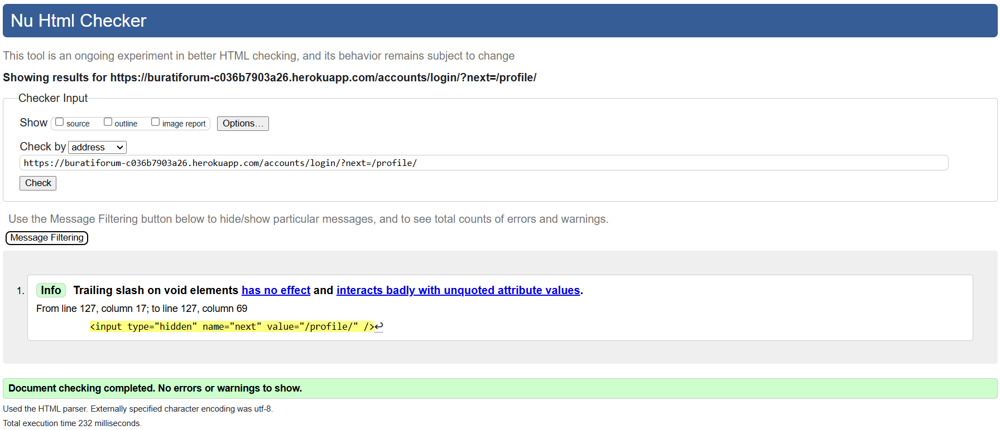 | Pass: No Errors |

### CSS

I have used the recommended [CSS Jigsaw Validator](https://jigsaw.w3.org/css-validator) to validate all of my CSS files.

| File | Jigsaw URL | Screenshot | Notes |
| --- | --- | --- | --- |
| style.css | [Jigsaw](https://jigsaw.w3.org) |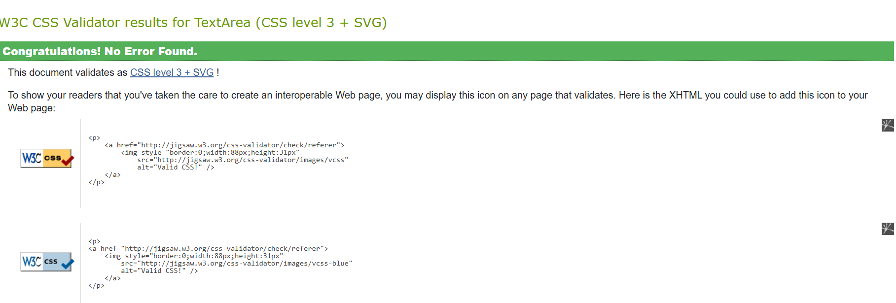 | Pass: No Errors |

### Python

I have used the recommended [PEP8 CI Python Linter](https://pep8ci.herokuapp.com) to validate all of my Python files.

### Forum App

| File |  Screenshot | Notes |
| --- | --- | --- |
| apps.py  | 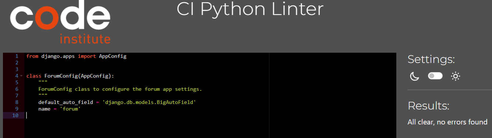 | Pass: No Errors |
| models.py |  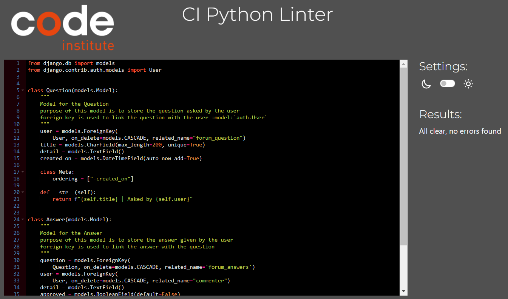 | Pass: No Errors |
| forms.py |  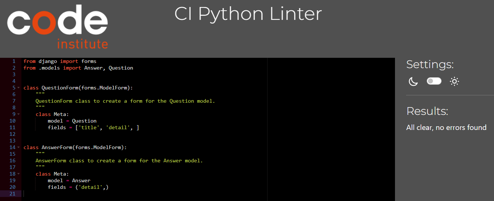 | Pass: No Errors |
| urls.py |  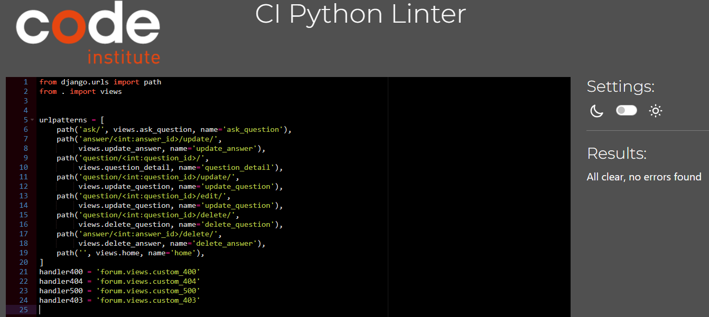 | Pass: No Errors |
| views.py |  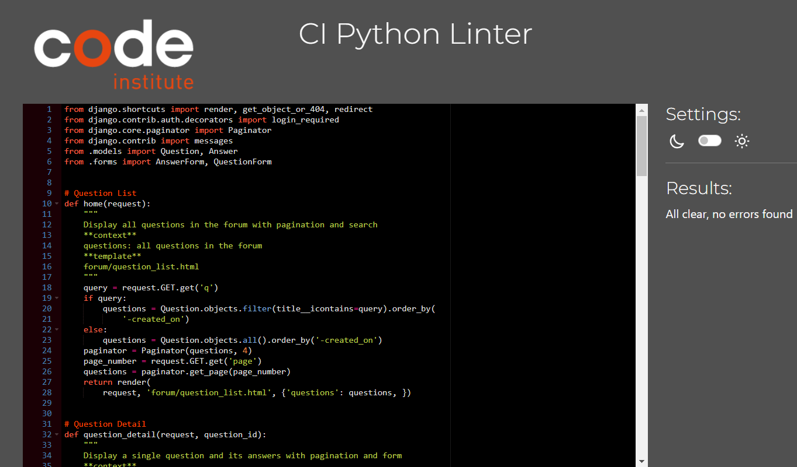 | Pass: No Errors |

### Forumuser App
| File |  Screenshot | Notes |
| --- | --- | --- |
| models.py |  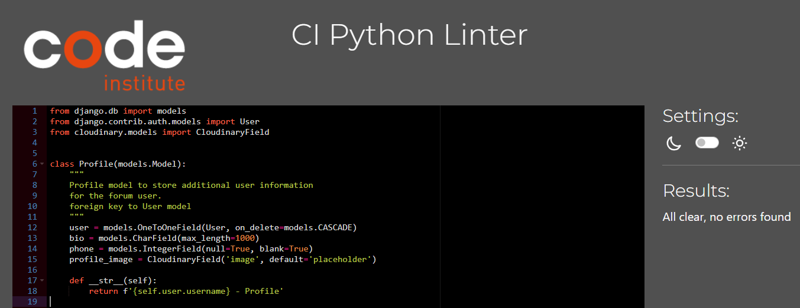 | Pass: No Errors |
| forms.py |  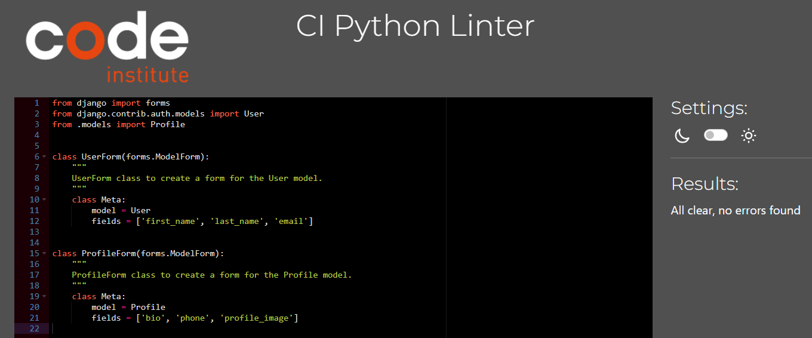 | Pass: No Errors |
| urls.py |  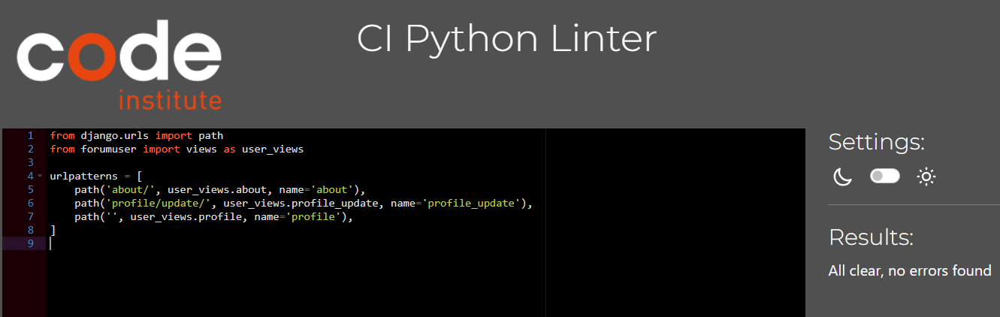 | Pass: No Errors |
| views.py |  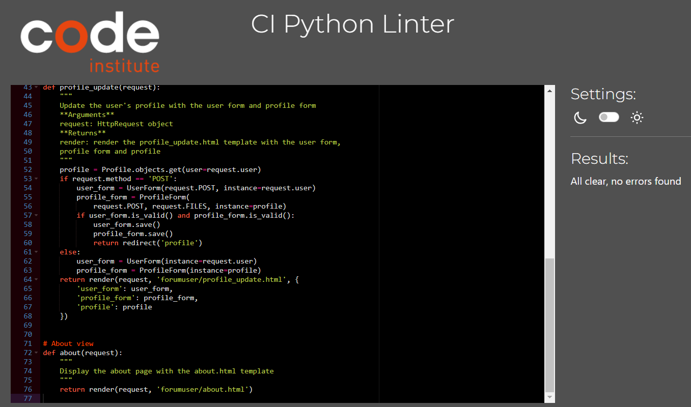 | Pass: No Errors |

### Lighthouse Audit

I've tested my deployed project using the Lighthouse Audit tool to check for any major issues.

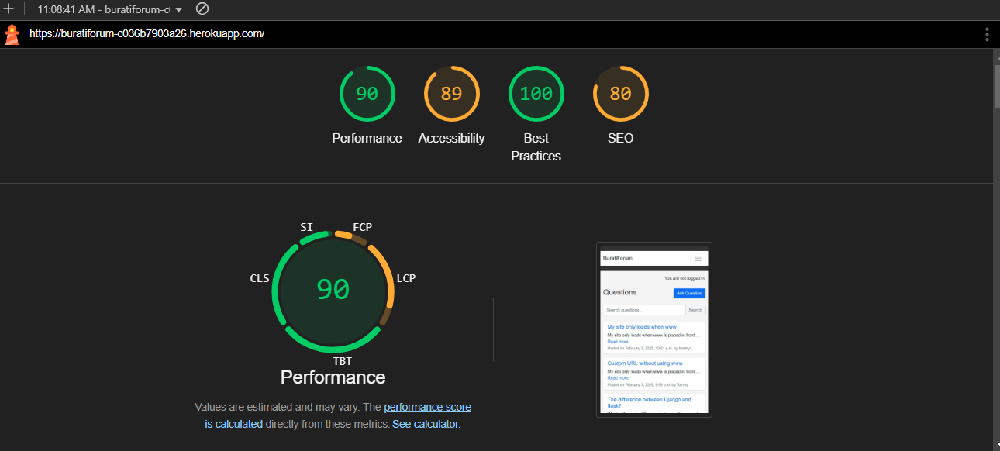